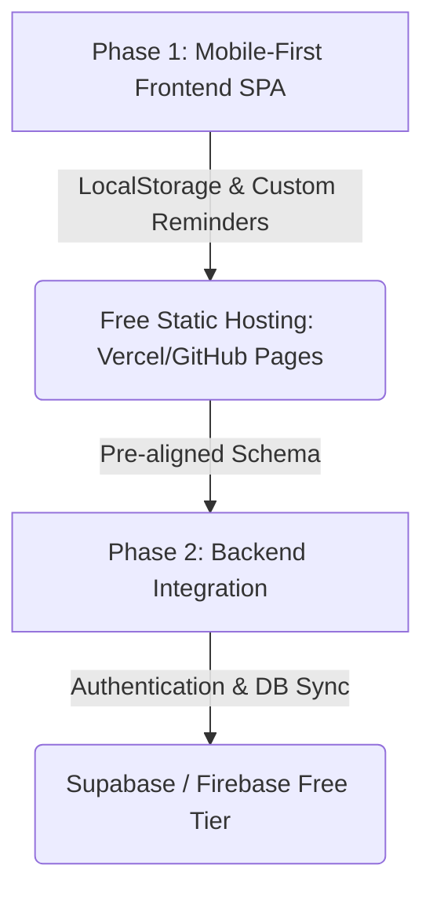

# Subscription Tracker Phased Implementation Plan

This plan details a mobile-first subscription tracking application. We will follow a phased rollout strategy designed to ensure rapid delivery, zero initial hosting cost, and a seamless path to future user management.

## Roadmap & Phasing Strategy



### Phase 1: Mobile-First Frontend (Current)
* **Goal**: Build a highly polished, responsive Single-Page Application (SPA).
* **Storage**: LocalStorage inside the browser.
* **Hosting**: Free static hosting via GitHub Pages, Vercel, Netlify, or Cloudflare Pages.
* **Alerts**: In-app notifications & local Native Browser Notification API based on upcoming renewals AND custom user-defined reminder dates.
* **Data Migration**: Local JSON export and import capabilities.
* **Calculations**: Support for custom interval tracking (e.g. every 2 weeks, 4 weeks, 3 months) and differentiation between service and product subscriptions.
* **Metadata & Actions**: Support for optional subscription management links, notes, and specific cancellation/review reminders.

### Phase 2: Authentication & Sync (Future)
* **Goal**: Add user accounts, multi-device synchronization, and secure cloud storage.
* **Hosting/Backend**: Supabase or Firebase (both provide excellent free tiers).
* **Migration Path**: 
  - Swap the LocalStorage state manager with the Supabase/Firebase JS SDK.
  - Add Login / Sign-up overlays.
  - Bind user records to their authenticated `user_id`.

---

## User Review Required

Please review the mobile-first UX layout decisions below.

> [!NOTE]
> All touch targets (buttons, links, form fields) will be set to a minimum of `48px x 48px` to comply with mobile accessibility guidelines.

> [!TIP]
> Once Phase 1 is approved, we will initialize the project folder in `C:/Users/steph/.gemini/antigravity/scratch/sub-tracker`. We recommend setting this folder as your active workspace.

---

## Proposed Changes

### Subscription Tracker Core (Phase 1)

#### [NEW] [index.html](file:///C:/Users/steph/.gemini/antigravity/scratch/sub-tracker/index.html)
Structure optimized for mobile-first rendering:
- **Viewport Meta Tag**: Configured with `width=device-width, initial-scale=1.0, maximum-scale=1.0, user-scalable=no` to prevent accidental zooming.
- **Bottom Navigation Bar (Mobile)**: Sticky bottom menu with tabs for `Dashboard`, `Subscriptions` (list), and `Analytics`. On desktop, CSS Media Queries will transform this tab bar into a sleek sidebar.
- **Floating Action Button (FAB)**: A prominent circular button positioned at the bottom right corner (accessible for thumb clicks) that opens the Add Subscription modal.
- **Views**:
  - **Dashboard**: 
    - Quick-toggle chips: `All`, `Services`, `Products`.
    - Spend counters (Monthly/Annual) which dynamically update based on the active quick-toggle filter.
    - Upcoming renewals section.
    - An in-app notifications icon/badge.
  - **Subscriptions List**: Includes a search input, category filter chip bar, and sorting controls.
  - **Analytics**: Contains custom SVG donut and bar charts.
- **Form Modal**: Full-screen or slide-up sheet on mobile, centered modal on desktop. Includes fields:
  - Name (text)
  - Cost (numeric)
  - Currency Symbol (e.g. `$`)
  - Subscription Type Switcher (`Service` | `Product`)
  - Billing Cycle: Frequency Value (numeric input) + Period Unit dropdown (`Weeks`, `Months`, `Years`)
  - Category (dropdown with custom option)
  - Next Renewal Date (date selector)
  - **[NEW]** Manage Subscription URL (optional web link input)
  - **[NEW]** Custom Notes (optional text area for details like account usernames, tiers, or conditions)
  - **[NEW]** Custom Reminder: Date Selector (optional date) and Reminder Text (optional text, e.g. "Cancel trial", "Check usage to downgrade")

#### [NEW] [styles.css](file:///C:/Users/steph/.gemini/antigravity/scratch/sub-tracker/styles.css)
Styles structured using **Mobile-First CSS**:
- **Mobile Styling (Default / Base Rules)**:
  - Bottom navigation bar: `position: fixed; bottom: 0; left: 0; right: 0;`.
  - Content containers: Stacked vertically with comfortable padding for smaller screens.
  - Interactive elements: Touch hover highlights, rounded corners, and smooth transitions.
  - Glassmorphic styling for Dark Mode: frosted glass effects using `backdrop-filter: blur(16px)` and translucent borders. High contrast, clean shadows, and soft boundaries for Light Mode.
  - Color-coded badges for types:
    - **Service**: Indigo/Purple gradient badges.
    - **Product**: Teal/Emerald gradient badges.
  - Style rules for optional fields:
    - External links for the "Manage Subscription" URL formatted as clean, accessible action icons or secondary buttons.
    - Expandable cards to show/hide custom notes and reminder details on tap.
- **Tablet & Desktop Styling (`@media` min-width breakpoints)**:
  - Navigation bar changes to a sticky sidebar layout on the left.
  - Content grids expand into multiple columns (e.g., 2 columns on tablet, 3-4 columns on wide monitors).
  - Modals adapt to centered dialogue overlays.
- **Animations**: Slide-up sheets for mobile forms, fade-in transitions for switching views, and scaling effects on card hover.

#### [NEW] [app.js](file:///C:/Users/steph/.gemini/antigravity/scratch/sub-tracker/app.js)
Logic handling Phase 1 features while preparing for Phase 2:
- **Data Model**:
  - Subscriptions will be stored as an array of objects.
  - Structure:
    ```json
    {
      "id": "uuid-v4-string",
      "name": "Netflix",
      "cost": 15.99,
      "currency": "$",
      "type": "service",
      "billingInterval": 1,
      "billingPeriod": "months",
      "nextRenewalDate": "2026-08-17",
      "category": "Entertainment",
      "manageUrl": "https://netflix.com/youraccount",
      "notes": "Shared with family.",
      "reminderDate": "2026-08-15",
      "reminderText": "Review plan for tier downgrade.",
      "createdAt": "2026-07-17T16:45:00Z"
    }
    ```
- **Cost Normalization Rules**:
  - Annual Cost calculation:
    - If `weeks`: `cost * (52 / billingInterval)`
    - If `months`: `cost * (12 / billingInterval)`
    - If `years`: `cost * (1 / billingInterval)`
  - Monthly Cost calculation: `annualCost / 12`
- **LocalStorage Sync & Tab Navigation**:
  - Functions to manage active view states and switch content screens dynamically.
  - Saves the data array to LocalStorage on every mutation.
- **Local Native Notifications**:
  - `requestNotificationPermission()`: Triggered upon user interaction or settings toggle.
  - `checkUpcomingRenewals()`: Scans the subscriptions list on load. It triggers:
    1. A renewal alert for services renewing in the next 3 days.
    2. A custom alert if the current date is on or after the `reminderDate` (and the reminder hasn't been dismissed).
- **Custom SVG Chart Renderer**:
  - Draws a responsive, animated SVG Donut Chart for category spending.
  - Draws a custom SVG Bar Chart showing upcoming monthly expenses.
- **JSON Import/Export**:
  - Seamlessly downloads or uploads a JSON file.

---

## Verification Plan

### Manual Verification
1. **Billing Calculations**:
   - Add "Netflix" ($15.99 a month). Check Dashboard: Monthly = $15.99, Annual = $191.88.
   - Add "Google Drive" ($2.99 a month). Check Dashboard: Monthly = $18.98, Annual = $227.76.
   - Add "MedSchool for moms" ($90 every 3 months). Check Dashboard: Monthly = $48.98 ($18.98 + $30.00), Annual = $587.76 ($227.76 + $360.00).
   - Add "Amazon - protein powder" ($60 every 4 weeks). 4 weeks means 13 times a year. Annual cost = $780.00. Monthly cost = $65.00. Check Dashboard: Monthly = $113.98 ($48.98 + $65.00), Annual = $1367.76 ($587.76 + $780.00).
   - Add "Amazon - dog treats" ($27.99 every 4 weeks). Annual cost = $363.87. Monthly cost = $30.32. Verify dashboard sums match.
   - Add "Amazon - bai drinks" ($15.99 every 2 weeks). 2 weeks means 26 times a year. Annual cost = $415.74. Monthly cost = $34.645. Verify dashboard sums match.
2. **Type Toggling**: Click the `Services` chip. Verify that only services (Netflix, Google Drive, MedSchool for moms) are listed and the spend totals adjust to show only their sums. Click `Products` and verify the same for Amazon subscriptions.
3. **Optional Link & Notes**:
   - Create a subscription with a "Manage URL" and some "Notes".
   - Verify the subscription card shows a button that opens the URL in a new tab.
   - Verify tapping/clicking the card expands it to display the custom notes.
4. **Custom Reminder System**:
   - Create a subscription with a custom `reminderDate` set to today's date, and `reminderText` set to "Cancel before trial ends".
   - Reload the page, grant notification permissions when prompted, and verify that a browser native notification fires containing the custom text "Cancel before trial ends" for that subscription.
5. **Mobile Responsiveness**: Test on mobile screen profiles. Verify that navigation remains at the bottom, touch targets are easily clickable, and modal forms act like native bottom sheets.
6. **Desktop Responsiveness**: Resize the browser window and verify the bottom tab bar transforms into a sticky sidebar and cards arrange in a multi-column grid.
7. **Theme Switching**: Toggle between dark glassmorphism and clean light mode, verifying visual consistency across all view tabs.
8. **Data Import/Export**: Export subscriptions as JSON, delete all local data, and re-import the file to verify complete recovery.
